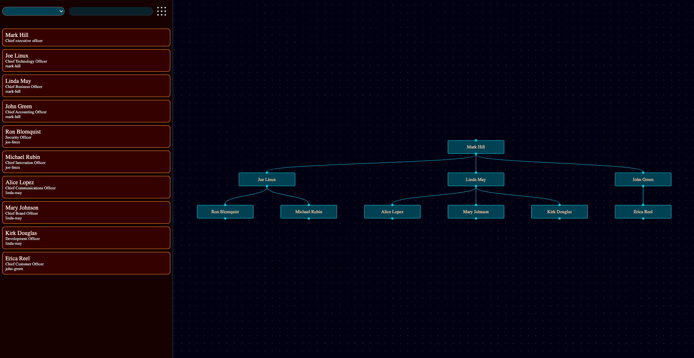
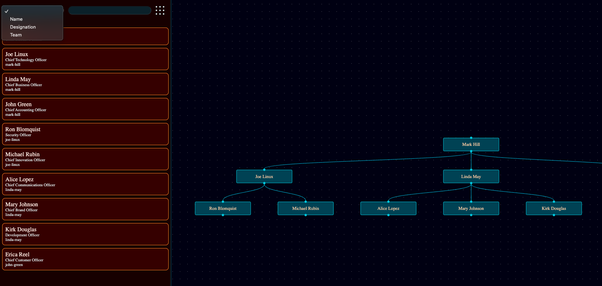
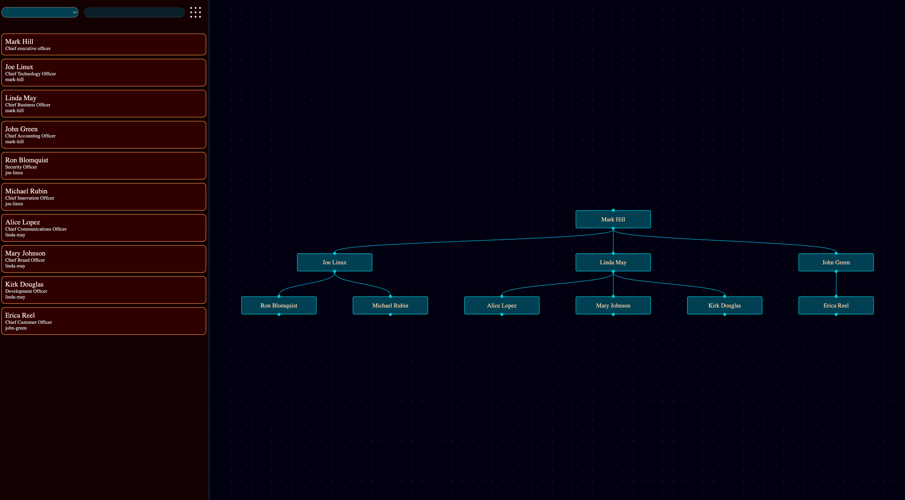
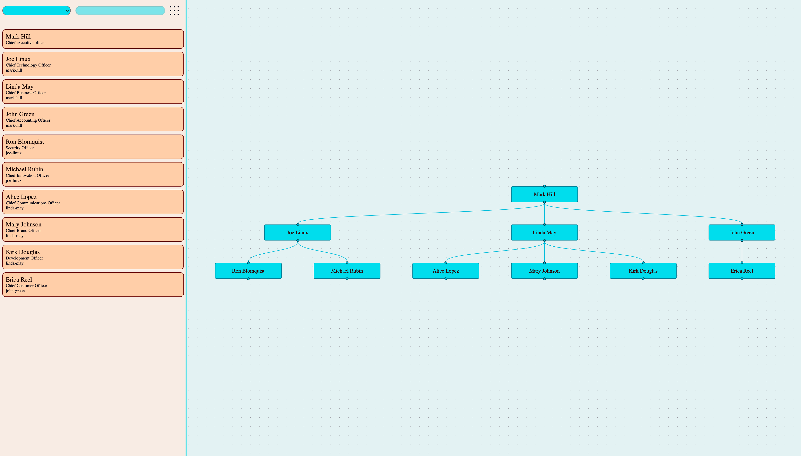
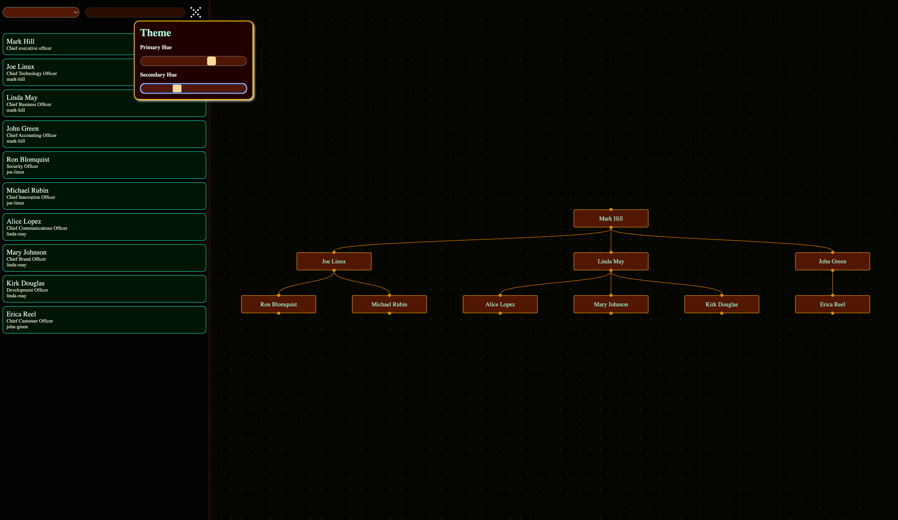
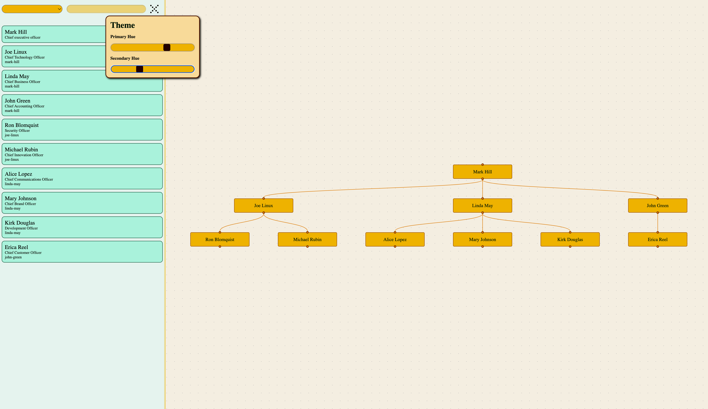

# Setup

1. clone the repo.
2. Open the repo in vscode. In bottom right corner it will show a alert to `install recommenced extensions`.
3. `npm install` on terminal.
4. Now click on `F1` or `ctrl+shift+p`/`cmd+shift+p` command pallet will appear. Search for Reload Window and select it. It will reload the vscode.
5. Now click on `F5` on meanwhile vscode's extension will start vite on terminal. Or you can run `npm run dev` on terminal the url is `http://localhost:4000/`

# Task

1. Initial UI will look like this
   
2. UI to add filter. Have validations on filters.
   
3. We can move all the nodes without the any direct report to lead level people.

# Extra Things

## Dark Theme and Light Theme

## Customize the UI colors

